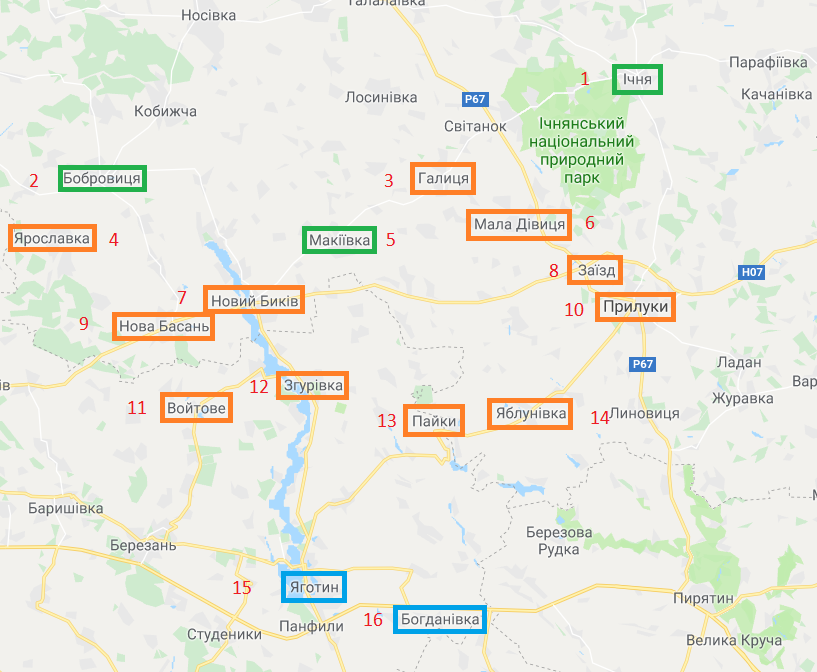

[]()

# Overview

**SVRP** is an app built for solving Special Vehicle Routing Problem.

## Description
Unmanned aerial vehicle systems (UAS), particularly unmanned aerial vehicles (UAVs), are increasingly being utilized. The extensive capabilities of UAS and their growing accessibility have led to an expansion of their applications. Nowadays, UAS are used for land surveys, anti-poaching efforts, monitoring and managing agricultural land, and the popularity of drone deliveries is rising globally. The military domain, in particular, benefits from the use of UAS for tactical or strategic reconnaissance, as it minimizes the risk to personnel.

During military operations, UAS groups are often employed. When employing a UAS group, pre-planning the routes becomes crucial, as adversaries may deliberately create interference, such as radio jamming, to disrupt real-time control.

This dissertation focuses on the route planning of UAS groups utilizing mobile UAV launch platforms. This topic is especially pertinent today, given that the United States Defense Advanced Research Projects Agency (DARPA) has launched the Gremlins program, which involves deploying UAV teams from existing large aircraft, such as bombers and transport planes.

The objective of this project is to minimize the costs associated with accomplishing the tasks assigned to the UAS group by optimizing their routes.

## Input
### Example of a task
```
NAME: test_task
VEHICLES: 3
CITY_COUNT: 16
START_DEPOT_COUNT: 3
END_DEPOT_COUNT: 2
EDGE_WEIGHT_SECTION
0.00 72.21 28.91 80.53 44.86 24.75 58.71 25.86 70.73 29.97 73.02 58.99 52.72 46.38 79.75 76.09
72.21 0.00 45.23 10.46 32.60 55.70 25.91 66.63 21.28 72.68 32.93 39.20 54.51 64.77 60.97 73.56
28.91 45.23 0.00 52.55 15.97 11.83 29.88 23.67 41.82 30.56 44.79 32.30 32.22 33.18 56.78 58.36
80.53 10.46 52.55 0.00 38.24 62.10 28.10 72.33 18.93 77.89 29.50 39.78 56.16 67.58 57.73 71.99
44.86 32.60 15.97 38.24 0.00 23.92 13.93 34.20 25.89 40.09 29.35 19.45 27.00 34.08 46.02 51.84
24.75 55.70 11.83 62.10 23.92 0.00 36.64 11.83 48.98 18.75 49.39 34.60 28.46 25.03 55.24 53.31
58.71 25.91 29.88 28.10 13.93 36.64 0.00 45.52 12.34 50.53 16.19 13.62 28.65 39.54 38.66 48.75
25.86 66.63 23.67 72.33 34.20 11.83 45.52 0.00 57.70 7.00 56.15 40.39 29.37 20.79 56.21 50.59
70.73 21.28 41.82 18.93 25.89 48.98 12.34 57.70 0.00 62.46 11.66 21.26 37.86 49.88 39.79 53.24
29.97 72.68 30.56 77.89 40.09 18.75 50.53 7.00 62.46 0.00 59.83 43.88 30.76 19.84 56.59 48.88
73.02 32.93 44.79 29.50 29.35 49.39 16.19 56.15 11.66 59.83 0.00 15.96 31.62 44.41 28.34 42.70
58.99 39.20 32.30 39.78 19.45 34.60 13.62 40.39 21.26 43.88 15.96 0.00 16.64 28.99 26.76 35.21
52.72 54.51 32.22 56.16 27.00 28.46 28.65 29.37 37.86 30.76 31.62 16.64 0.00 12.88 27.11 26.18
46.38 64.77 33.18 67.58 34.08 25.03 39.54 20.79 49.88 19.84 44.41 28.99 12.88 0.00 36.85 29.80
79.75 60.97 56.78 57.73 46.02 55.24 38.66 56.21 39.79 56.59 28.34 26.76 27.11 36.85 0.00 17.25
76.09 73.56 58.36 71.99 51.84 53.31 48.75 50.59 53.24 48.88 42.70 35.21 26.18 29.80 17.25 0.00
START_DEPOT_SECTION
0
1
4
END_DEPOT_SECTION
14 2
15 1
```
### Visualization of the task

**Green** - a start depot,
**Orange** - a city to visit,
**Blue** - an end depot.



## Results

**f** - the best result

**q** - relative error (in percentages)

**t** - algorithm execution time (in nanoseconds)

| Task 	|  n 	| TabuSearch  	|      	|       	| MMAS 	|      	|        	| IMMAS 	|   	|        	|
|:----:	|:--:	|:-----------:	|:----:	|:-----:	|:----:	|:----:	|:------:	|:-----:	|:-:	|:------:	|
|      	|    	|      f      	|   q  	|   t   	|   f  	|   q  	|    t   	|   f   	| q 	|    t   	|
|   1  	| 16 	|     3657    	| 26.9 	| 2.3E6 	| 2880 	|   0  	|  7.0E9 	|  2880 	| 0 	|  8.9E9 	|
|   2  	| 30 	|     3906    	|  6.6 	| 2.6E6 	| 3770 	|  2.9 	| 4.5E10 	|  3662 	| 0 	| 5.5E10 	|
|   3  	| 36 	|     4962    	| 16.6 	| 6.8E6 	| 4395 	|  3.3 	| 7.8E10 	|  4253 	| 0 	| 8.6E10 	|
|   4  	| 43 	|     4858    	| 10.5 	| 7.4E7 	| 4529 	|   3  	| 1.5E11 	|  4396 	| 0 	| 1.7E11 	|
|   5  	| 57 	|     7035    	| 13.7 	| 1.4E7 	| 6361 	|  2.8 	| 2.9E11 	|  6185 	| 0 	| 3.2E11 	|
|   6  	| 65 	|     8414    	| 10.1 	| 1.5E7 	| 7925 	|  3.7 	| 8.5E11 	|  7641 	| 0 	| 9.8E11 	|
|   7  	| 70 	|     7912    	|   0  	| 1.5E7 	| 8940 	| 12.9 	| 8.7E11 	|  8179 	| 3 	|  1E12  	|
